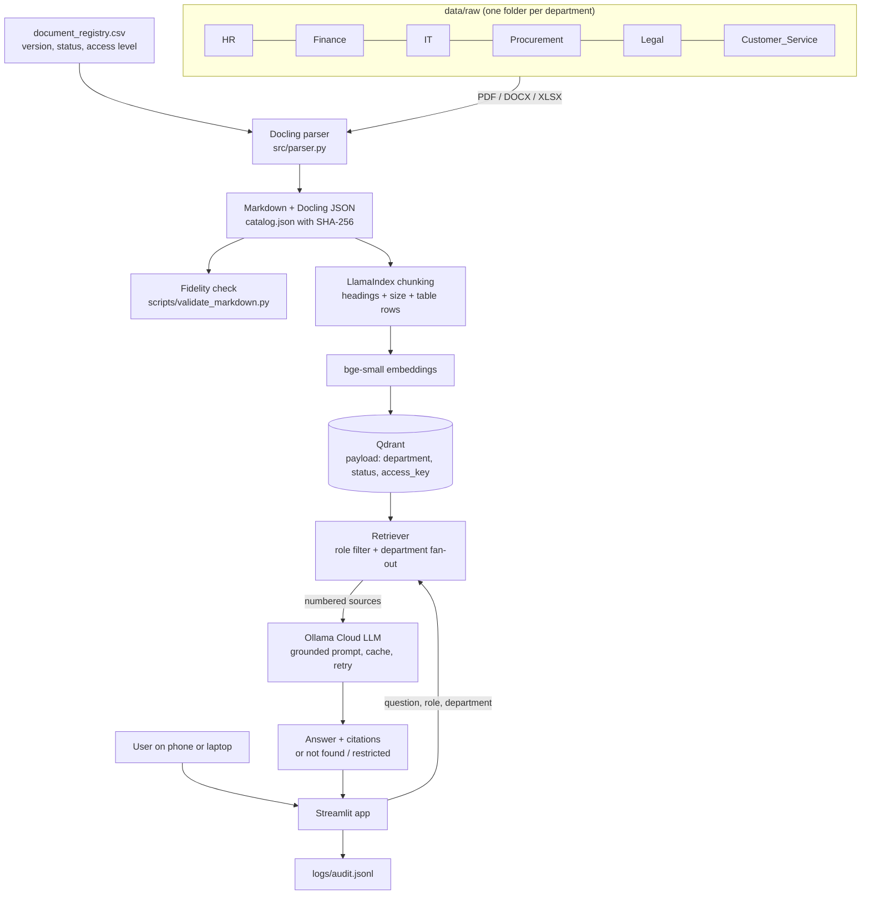

# NexaCore AI

**An Enterprise Multi-Department Knowledge & Compliance Intelligence Platform using Retrieval-Augmented Generation**

NexaCore Technologies is a fictional company with six departments. Each department keeps its own policies, matrices, legal templates and customer documents as PDF, DOCX and XLSX files. NexaCore AI converts those files to Markdown with Docling, indexes them with LlamaIndex into Qdrant, and answers employee questions through Ollama Cloud. Every answer cites its sources, and what the model can see depends on the user's role.

| Layer | Choice |
|---|---|
| OS | Ubuntu (Classroom 2 lab) |
| Parser | Docling (TableFormer tables, optional OCR) |
| RAG framework | LlamaIndex |
| Embeddings | BAAI/bge-small-en-v1.5, local CPU |
| Vector DB | Qdrant in Docker (chosen after comparison, see `docs/VECTOR_DB_COMPARISON.md`) |
| LLM | Ollama Cloud free model |
| Web UI | Streamlit, mobile friendly, shared with Cloudflare Tunnel |
| Evaluation | 23 ground-truth questions, Hit@k, MRR, answer accuracy, LLM-judge faithfulness, chunking ablation |

## Architecture



## What the engine does

- **Role-based access.** Each chunk carries `access_key = department|access_level`. A Qdrant filter keeps restricted documents (benefits by grade, vendor payment terms, NDA terms) away from roles that do not own them. If a restricted document would have answered the question, the user is told to contact the owning department.
- **Department filter.** Search one department or all of them.
- **Cross-department answers.** For "All departments" the retriever runs one filtered search per department and keeps every department whose best match is close to the overall best. Vendor onboarding pulls from Procurement, IT, Legal and Finance this way.
- **Version awareness.** Superseded documents are excluded by default. A toggle brings them back to compare the 2025 and 2026 leave policies.
- **Conflicts.** The prompt asks the model to point out disagreements. The corpus has a planted one: HR says expense claims are due in 45 days, Finance says 30.
- **Citations and "not found".** Answers cite `[S1]`, `[S2]` and the UI lists file, section, version and score. Low scores or the model's `INSUFFICIENT_EVIDENCE` signal return a "not found" message instead of a guess.
- **Table handling.** Every table row is also indexed as `Header: value; Header: value`, so "Who approves INR 3,00,000?" matches the right row of the approval matrix.
- **Free-tier friendly.** LLM responses are cached on disk and retried with backoff.

## Repository layout

```
nexacore-rag/
├── setup.sh                     one-command install on Ubuntu
├── docker-compose.yml           Qdrant
├── Dockerfile                   Ubuntu 22.04 image with Docling, LlamaIndex and models baked in
├── docker-compose.offline.yml   run everything from pre-built images
├── requirements.txt / .env.example
├── config/roles.yaml            roles and the restricted departments they can read
├── data/
│   ├── raw/<Department>/        18 source documents (7 PDF, 6 DOCX, 5 XLSX)
│   ├── document_registry.csv    department-maintained metadata
│   ├── fact_sheet.yaml          ground truth used for fidelity checks and evaluation
│   └── converted/               Docling output (created by src.parser)
├── src/
│   ├── config.py                settings from .env
│   ├── parser.py                Part-I: Docling conversion
│   ├── indexing.py              chunking, embeddings, Qdrant
│   ├── rag.py                   retrieval, access control, prompt, answer
│   ├── models.py                embedding model, Ollama Cloud LLM with cache and retry
│   └── access.py                role checks
├── app/streamlit_app.py         web Q&A interface
├── evaluation/
│   ├── questions.jsonl          23 questions across 9 categories
│   ├── run_eval.py              metrics, LLM judge, ablation
│   └── results/                 CSV, JSON and Markdown outputs
├── scripts/
│   ├── generate_documents.py    rebuilds the synthetic corpus
│   ├── validate_markdown.py     parser fidelity report
│   ├── benchmark_vector_dbs.py  Qdrant vs Chroma measurements
│   ├── check_ollama.py          confirms Ollama Cloud access
│   ├── windows_build_images.ps1 build and save images on Windows
│   ├── wsl_load_images.sh       load images in Ubuntu without internet
│   └── get_ip.sh                machine IP for the submission
└── docs/                        install guide, DB comparison, deployment, agent prompts, report outline, team plan
```

## Run it (lab machine)

```bash
# copy nexacore-rag.zip from email to the lab machine, e.g. ~/Downloads
cd ~ && unzip ~/Downloads/nexacore-rag.zip   # no unzip? python3 -m zipfile -e ~/Downloads/nexacore-rag.zip .
cd nexacore-rag
bash setup.sh                                  # about 10 to 15 minutes the first time
source .venv/bin/activate
nano .env                                      # paste OLLAMA_API_KEY
python scripts/check_ollama.py                 # lists models, sends a test prompt

# Part-I: parsing
python -m src.parser                           # data/raw -> data/converted
python scripts/validate_markdown.py            # evaluation/results/parser_fidelity.md

# Part-II: RAG
python -m src.indexing --recreate
python -m src.rag "What is the process for onboarding a new vendor?"
python -m src.rag "How long does NDA confidentiality last?" --role "Legal Counsel"

# Web app
streamlit run app/streamlit_app.py --server.address 0.0.0.0 --server.port 8501
```

Public link for phones: see `docs/DEPLOYMENT.md`.

**Ubuntu has no internet but Windows does?** Use the Docker route in `docs/DOCKER_OFFLINE.md`: Windows builds an image with everything inside, Ubuntu loads it and runs parsing offline.

## Evaluation

```bash
python -m evaluation.run_eval --retrieval-only   # no LLM calls
python -m evaluation.run_eval --ablation         # 3 chunking strategies x 3 chunk sizes
python scripts/benchmark_vector_dbs.py           # needs: pip install chromadb llama-index-vector-stores-chroma
python -m evaluation.run_eval --judge            # full answers + faithfulness/relevancy (off-peak hours)
```

Results land in `evaluation/results/`. Use `top_score` for the unsupported questions in `rag_eval.csv` to tune `SIMILARITY_CUTOFF`.

## Submission checklist

| Faculty item | Where |
|---|---|
| a) Coding agent prompts | `docs/CODING_AGENT_PROMPTS.md` |
| b) Platform | `docs/CODING_AGENT_PROMPTS.md` (top section) |
| c) Full code | this folder, zipped without `.venv`, `.cache`, `qdrant_storage` and `.env` (see below) |
| d) Parser installation steps | `docs/INSTALL_DOCLING.md`, `setup.sh`, `setup.log` |
| e) Machine IP | `bash scripts/get_ip.sh` output + screenshot |
| f) Architecture and results report | `docs/REPORT_OUTLINE.md` + `evaluation/results/` |

## Regenerating the corpus

`python scripts/generate_documents.py` rebuilds all 18 documents and the registry from `scripts/corpus.py`. Edit that file to add documents, then update `data/fact_sheet.yaml` and `evaluation/questions.jsonl` to match.

## Moving the project between machines

The project travels as a zip, not through Git. To package the lab copy for submission or to send updates to teammates:

```bash
cd ~ && zip -r nexacore-rag-final.zip nexacore-rag \
  -x "nexacore-rag/.venv/*" "nexacore-rag/.cache/*" "nexacore-rag/qdrant_storage/*" "nexacore-rag/.env" "*/__pycache__/*"
```

Keep one master copy on the lab machine so the team does not end up with diverging versions.
